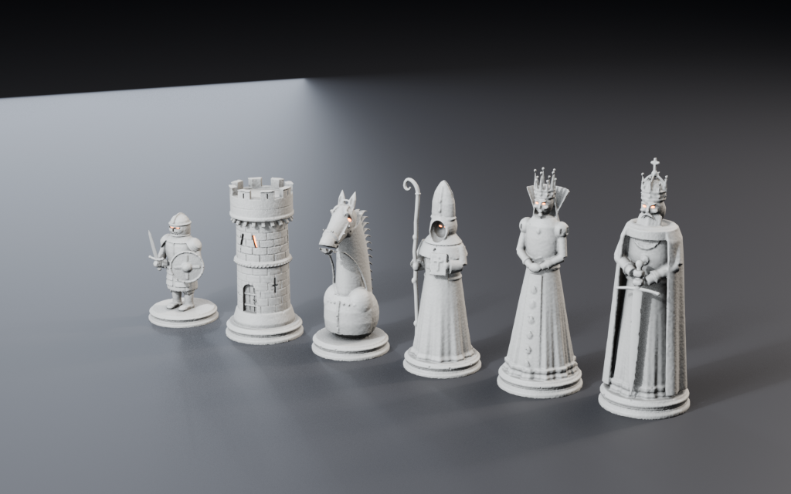
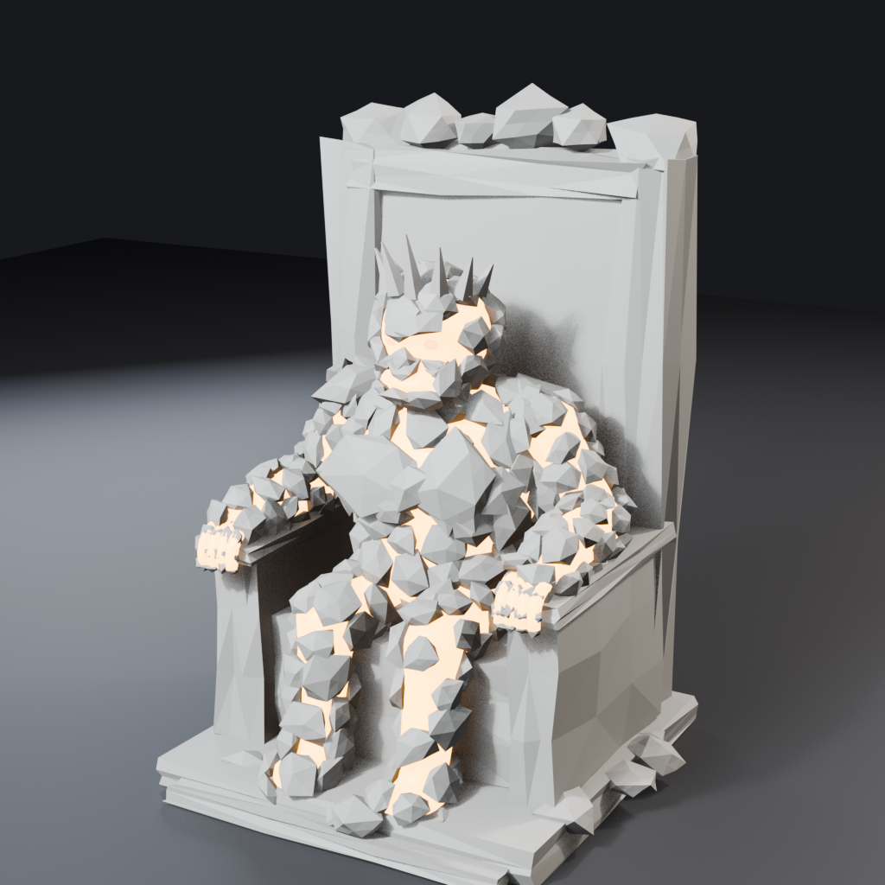
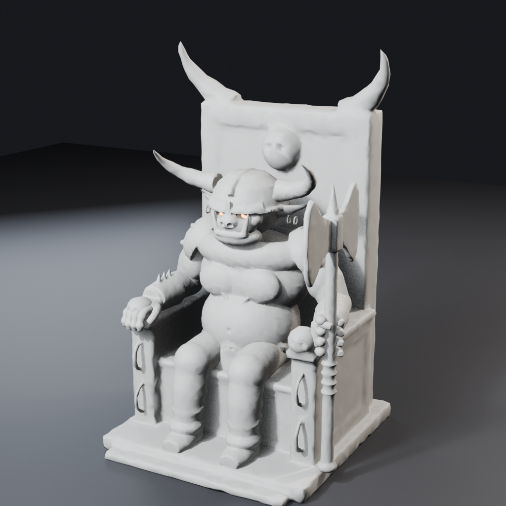
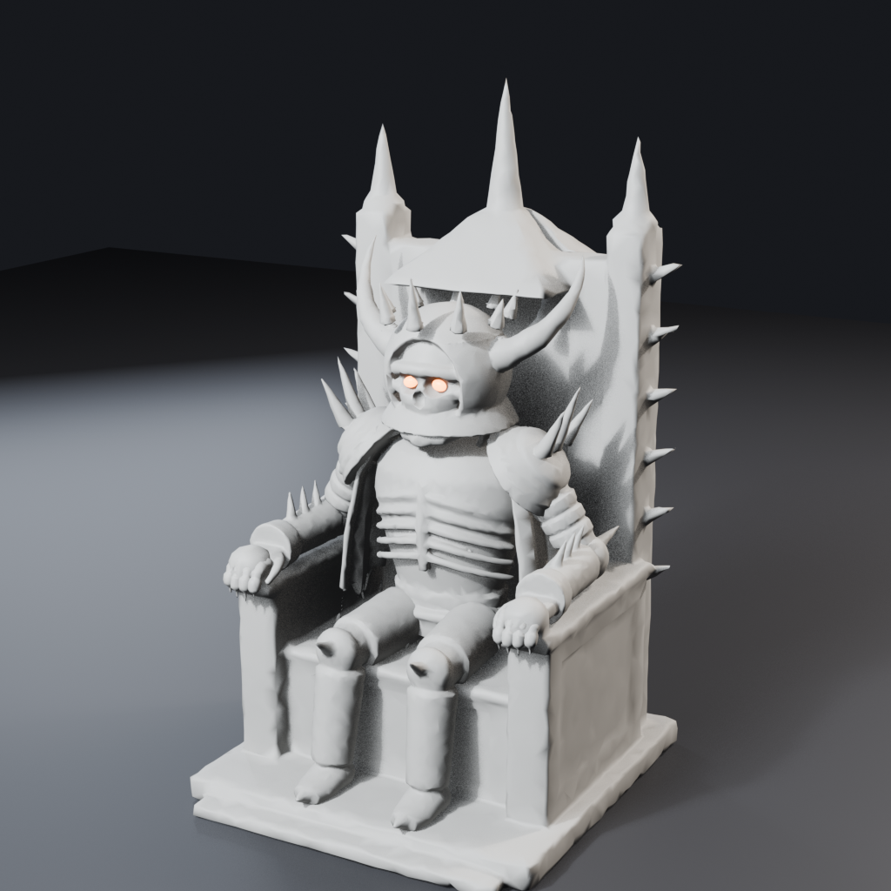
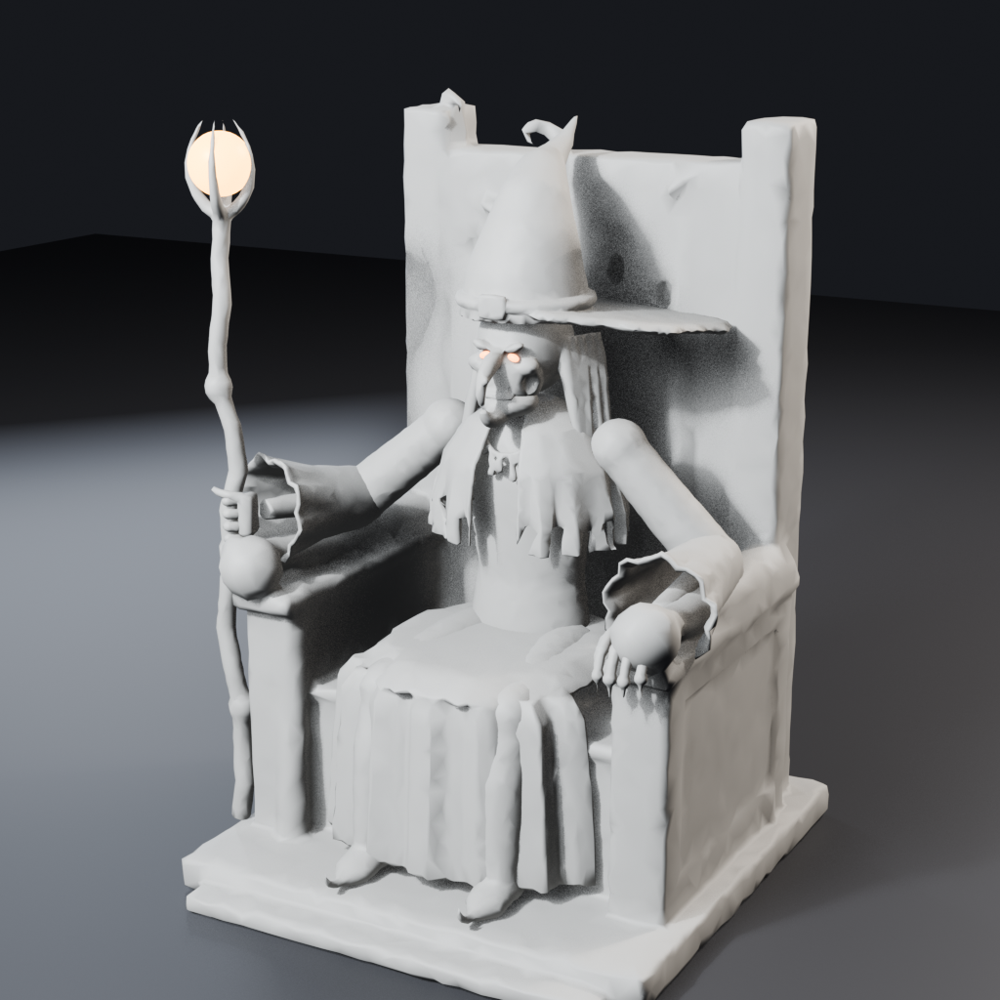

# Wizard's Chess 3D assets

Carved-stone chess pieces and seated villain giants for the browser game, built procedurally in Blender 5.2 (Python API, headless) and exported as glTF 2.0 binaries for three.js r128 `GLTFLoader`.



## Conventions (read this first)

- **Units:** 1 unit = 1 board square. **Up:** +Y in glTF (exported with "+Y Up").
- **Facing:** every piece and villain faces **−Z in glTF** (three.js forward). In Blender the delivered models face +Y. The original brief also said "faces −Y in Blender", but that and "−Z in glTF" cannot both hold with the default +Y-up export, so −Z in glTF was chosen. Rotate Black by π about Y to face White.
- **Origin:** each piece's plinth bottom is at y = 0, centred on x = z = 0. Villain thrones sit on y = 0.
- **Transforms:** every mesh has identity rotation and scale. A weapon node is translated to its grip; everything else has zero translation relative to its parent. No animations, cameras, lights or Draco.
- **Materials:** `stone` / `stone_<piece>` are neutral grey (base 0.5, roughness 0.6) for the game to replace with marble or obsidian. `glow` = eyes and visor light (tint per side). `emissive` = lava cracks and orbs. three.js r128 uses `uv2` for `aoMap`; `GLTFLoader` copies `uv` to `uv2` automatically when an occlusion texture is present.

## pieces.glb (4.49 MB)

Six top-level empties: `pawn`, `rook`, `knight`, `bishop`, `queen`, `king`. Each body has its own `stone_<piece>` material with an embedded **1024² tangent-space normal map** (JPEG) and a **512² ambient occlusion map** (JPEG, red channel), both baked from the high-poly voxel sculpt (chips, chisel wear and grain live in these maps).

| Piece | Child nodes | Triangles (body / eyes / weapon = total) | Height | Plinth radius | Maps |
|---|---|---|---|---|---|
| pawn | `pawn_body`, `pawn_eyes`, `pawn_weapon` | 11499 / 392 / 1300 = **13191** | 1.061 | 0.341 | normal + AO |
| rook | `rook_body`, `rook_eyes` | 11499 / 24 / – = **11523** | 1.451 | 0.371 | normal + AO |
| knight | `knight_body`, `knight_eyes` | 11474 / 392 / – = **11866** | 1.503 | 0.361 | normal + AO |
| bishop | `bishop_body`, `bishop_eyes`, `bishop_weapon` | 11497 / 392 / 1300 = **13189** | 1.702 | 0.352 | normal + AO |
| queen | `queen_body`, `queen_eyes` | 11500 / 392 / – = **11892** | 1.901 | 0.371 | normal + AO |
| king | `king_body`, `king_eyes`, `king_weapon` | 11500 / 392 / 1300 = **13192** | 2.101 | 0.381 | normal + AO |

Weapons (`pawn_weapon` short sword, `bishop_weapon` crooked staff, `king_weapon` point-down greatsword) have their origin at the hand grip, so `weapon.rotation` swings them around the grip. They use the plain `stone` material with no baked maps.

Embedded images: `bishop_normal` (image/jpeg), `bishop_ao` (image/jpeg), `king_normal` (image/jpeg), `king_ao` (image/jpeg), `knight_normal` (image/jpeg), `knight_ao` (image/jpeg), `pawn_normal` (image/jpeg), `pawn_ao` (image/jpeg), `queen_normal` (image/jpeg), `queen_ao` (image/jpeg), `rook_normal` (image/jpeg), `rook_ao` (image/jpeg).

## Villains

One GLB per villain, seated on its throne, about 6.5 units tall at the top of the head. They are rigged as a plain object hierarchy (no skinning). Every pivot is an empty, and the meshes are its children:

```
<name>
├─ throne                    mesh, base at y = 0
├─ legs                      mesh (static, seated)
└─ body                      pivot at the hips
   ├─ torso (+ cloak / lava_torso)
   ├─ head                   pivot at the neck → head_geo, eyes (glow)
   │  └─ jaw                 pivot at the hinge → jaw_geo
   ├─ arm_L / arm_R          pivot at the shoulders → upperarm_*
   │  └─ fore_L / fore_R     pivot at the elbows → forearm_* (+ weapon)
   │     └─ finger_L_0..3 / finger_R_0..3   pivots at the knuckles → finger_*_geo
```

`_L` is the villain's own left (−X in glTF while facing −Z). `finger_*_0` is the index finger and `finger_*_3` the little finger. Curl a finger by rotating its node about its local X axis; open the jaw by rotating `jaw` about X. No baked maps are embedded in the villains; their detail is in the geometry.

Basalt comes in a little under the 40k target (about 37k): his faceted rocks need fewer triangles to read well.

| File | Size | Triangles | Materials | Meshes (triangles) |
|---|---|---|---|---|
| `villain_basalt.glb` | 3.21 MB | 37200 | emissive, glow, stone | `eyes` 576, `finger_L_0_geo` 320, `finger_L_0_lava` 116, `finger_L_1_geo` 320, `finger_L_1_lava` 116, `finger_L_2_geo` 320, `finger_L_2_lava` 116, `finger_L_3_geo` 320, `finger_L_3_lava` 116, `finger_R_0_geo` 320, `finger_R_0_lava` 116, `finger_R_1_geo` 320, `finger_R_1_lava` 116, `finger_R_2_geo` 320, `finger_R_2_lava` 116, `finger_R_3_geo` 320, `finger_R_3_lava` 116, `forearm_L` 2400, `forearm_R` 2480, `head_geo` 2592, `jaw_geo` 1040, `lava_forearm_L` 370, `lava_forearm_R` 370, `lava_head_geo` 632, `lava_jaw_geo` 292, `lava_legs` 988, `lava_torso` 1484, `lava_upperarm_L` 370, `lava_upperarm_R` 370, `legs` 6400, `throne` 2468, `torso` 7040, `upperarm_L` 1920, `upperarm_R` 1920 |
| `villain_grukk.glb` | 1.46 MB | 51975 | glow, stone | `axe` 3094, `eyes` 514, `finger_L_0_geo` 360, `finger_L_1_geo` 360, `finger_L_2_geo` 360, `finger_L_3_geo` 360, `finger_R_0_geo` 360, `finger_R_1_geo` 360, `finger_R_2_geo` 360, `finger_R_3_geo` 360, `forearm_L` 2888, `forearm_R` 2888, `head_geo` 7220, `jaw_geo` 1650, `legs` 5674, `throne` 11347, `torso` 9284, `upperarm_L` 2268, `upperarm_R` 2268 |
| `villain_malvorn.glb` | 1.60 MB | 51826 | glow, stone | `cloak` 4207, `eyes` 530, `finger_L_0_geo` 370, `finger_L_1_geo` 370, `finger_L_2_geo` 370, `finger_L_3_geo` 370, `finger_R_0_geo` 370, `finger_R_1_geo` 370, `finger_R_2_geo` 370, `finger_R_3_geo` 370, `forearm_L` 2756, `forearm_R` 2757, `head_geo` 7321, `jaw_geo` 1590, `legs` 5306, `throne` 11670, `torso` 8487, `upperarm_L` 2121, `upperarm_R` 2121 |
| `villain_morwen.glb` | 1.50 MB | 51969 | emissive, glow, stone | `eyes` 576, `finger_L_0_geo` 346, `finger_L_1_geo` 346, `finger_L_2_geo` 346, `finger_L_3_geo` 346, `finger_R_0_geo` 346, `finger_R_1_geo` 346, `finger_R_2_geo` 346, `finger_R_3_geo` 346, `forearm_L` 2316, `forearm_R` 2316, `head_geo` 8106, `jaw_geo` 1388, `legs` 3474, `orb` 694, `robe_skirt` 3474, `staff` 2315, `throne` 12735, `torso` 8103, `upperarm_L` 1852, `upperarm_R` 1852 |






## Rebuilding

```sh
cd assets/3d/scripts
./build_all.sh            # all pieces + villains + previews + validation + README (~25 min on an M4)
```

| Script | Purpose |
|---|---|
| `wc_lib.py` | Shape builders, sculpt pipeline (voxel remesh, boolean chips, weathering), decimation, UVs, baking, materials |
| `pieces_def.py` / `build_piece.py` | Shapes for the six pieces; builds one piece (high-poly sculpt, 11.5k-tri low-poly, normal + AO bake) |
| `assemble_pieces.py` | Merges the pieces, turns them to face −Z in glTF, and exports `pieces.glb` |
| `villains_def.py` / `build_villain.py` | Villain shapes and the rigid hierarchy; exports `villain_<name>.glb` |
| `preview.py` | 1024 px EEVEE render with three-point lighting |
| `validate.py` | Re-imports each GLB and checks node names, sizes (±5%), facing, materials, budgets and limits |
| `gltf_fix.py`, `validate_gltf.mjs` | Repairs degenerate tangents, then runs the Khronos glTF validator |

`blend/` holds the assembled `.blend` scenes with textures packed.
